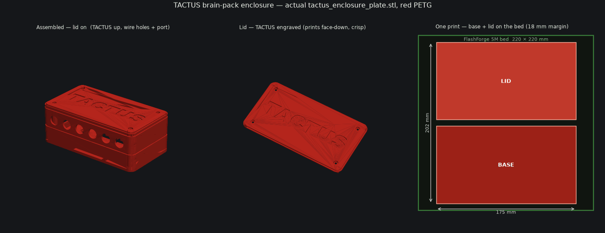

# CAD — the printed enclosure + body-coupling pucks (FlashForge Adventurer 5M)

Everything printed for the **12-channel, no-solder** rig in [`truth.md`](../truth.md) (canonical). One **enclosure** that houses the audio source + amp boards + power, and the **coupling pucks** that turn each de-housed **Ø52 mm SK473 KHD driver** into a body tactor.

> ⚙️ **Render note:** the installed **OpenSCAD is x86 and will not run on this arm64 Mac** (no Rosetta). So the print-ready parts are generated **headless with manifold3d** (the exact-boolean kernel modern OpenSCAD uses) via Python — no GUI. The `.scad` files remain the human-readable sources; the OpenSCAD-only parts (§ "Reference parts") need an OpenSCAD machine to re-render.

---

## ★ PRINT THIS — the verified print-ready set

All four are **single watertight bodies, no supports, fit the 220³ bed.** Drop the STLs straight into the slicer.

| File | Size (mm) | Qty | Orient | Material | Time |
|---|---|---|---|---|---|
| **`tactus_enclosure_plate.stl`** — base + lid, **ONE print** | base 175×97×63, lid 175×97×8 (plate 175×202) | 1 | as-exported, support-free | PETG | ~7–10 h |
| `actuator_cup.stl` (Ø52 driver) | 75.4 × 57.4 × 30.4 | ~14 | open-side up | PETG/TPU | ~14 min |
| `actuator_button.stl` | 14 × 14 × 9 | ~14 | flat-side down | PETG/TPU | ~6 min |

Common: 0.2 mm layer · 3 walls · 4 top/bottom · 15–20 % gyroid · **supports NONE** · brim 5 mm (enclosure) / skirt (pucks) · PETG 235/80 °C.

**The new box** — rounded, one compartment, **TACTUS** engraved big + bold (Arial Black) on the lid; base + lid print side-by-side as one plate:


### What lives inside (per truth.md §3 — laptop is the brain, no Pi)
| Bay | Holds |
|---|---|
| One compartment (lidded) | **2× Vantec NBA-200U** (100×58×26; the 6 SK473 **audio jacks** plug in here) + **1× 10-port hub** (the 6 SK473 **USB** leads + 2 Vantec data leads plug in here). **No Pi, no ESP32, no boards** — the SK473 amp+driver units are on the **vest**; their 12 cables enter the wall holes. |
| Power | **Mode A** = the 10-port hub (in the box). **Mode B** = **Anker 737** (155.7×54.6×49.5) — has its own plug, so it velcros **outside** the box / on the belt. |

> **Why this enclosure (not `tactus_box`):** truth.md names `tactus_box` for the enclosure, but its pre-rendered STL is **non-watertight (8 disconnected chunks)** and **can't be re-rendered here** (OpenSCAD won't run). `tactus_enclosure` is the **manifold3d** equivalent — same contents, **verified watertight single body**, integrated power bay (so no separate `tactus_power_cradle`), re-renders headless. Use it for the print.

---

## Render → STL (headless, no OpenSCAD)
```bash
/tmp/tactuscad/bin/python cad/tactus_enclosure.py   # → _base.stl, _lid.stl, and _plate.stl (the ONE-print file) + bed-fit assert
/tmp/tactuscad/bin/python cad/_puck_render.py       # → actuator_cup.stl + actuator_button.stl (at spk_dia=52)
```
The venv `/tmp/tactuscad` has `trimesh` + `manifold3d`. `tactus_enclosure.py` **errors out if any feature would print disconnected** — a single watertight body is guaranteed or the build fails.

## ⚠️ The one open dimension — the driver Ø
- **Ø52 mm is web-verified** (OEM Havit HV-SK473, literal "Φ52 mm*2" from two independent retailers; zero dissenting sources). The puck bore is **Ø52.6** (52 + 0.6 fit gap) and `spk_dia=52` is set across `actuator_puck.scad`, `tactus_node_mount.scad`, `tactus_chest_plate.scad`.
- **Caliper the physical driver before the full run** (truth.md §8 #1): published "52 mm" is the nominal *frame* OD (what the cup grips), but no source separates cone vs frame, and driver *depth* / magnet Ø are unpublished (puck uses a generous `spk_depth=27`). **Print one cup, drop the driver in, confirm the grip, then batch the rest.**

## Reference parts (OpenSCAD-only — need an OpenSCAD machine to re-render)
- `tactus_box.scad` / `tactus_power_cradle.scad` — truth.md's original split enclosure. Superseded for printing by `tactus_enclosure` (above). Their STLs are non-watertight; don't print them.
- `tactus_node_mount.scad` + `tactus_socket.scad` / `tactus_chest_plate.scad` — the **adjustable** body-mount alternative to the puck (split-clamp collar + depth micro-adjust). `drv_dia` is set to the verified **52 mm**; the pre-rendered STLs are still at the old 58 mm placeholder — **re-render in OpenSCAD** before printing these. The `actuator_puck` (above) is the working coupler if you don't need the adjustable mount.

## Slicing (FlashForge Adventurer 5M — open-frame, web-confirmed)
PETG for the enclosure (heat tolerance near the warm boards + bank; tougher bosses); PLA fine for a fast start. Pucks: PETG or TPU (TPU = softer skin contact). 0.2 mm · 3 walls · 4 top/bottom · 15–20 % gyroid · **no supports** · brim 5 mm on the base. Queue base / lid / a tray of pucks across printers — all hands-off.

## Assembly (no soldering — truth.md §3, docs/09)
1. Self-tap the 4 lid bosses with the M3 screw (PETG self-taps).
2. Lash the **2 Vantec + 6 SK473 boards** to the floor zip-tie grid over foam. Each board: 3.5 mm plug → a Vantec jack; USB-A → the hub.
3. De-house each Ø52 mm driver (leads stay on the board — no solder), seat in a cup, glue a button to the dust cap, run the lead out the comb; strain-relieve both ends.
4. Drop the Anker/hub into the open back bay → velcro through the floor strap slots → screen out the back.
5. Lid on, 4× M3. *(Optional wear: waistband through the 2 floor belt slots, or zip-tie via the 4 corner lash holes.)*

## ArUco marker (vision) — OPTIONAL validation rig only
Registration is **markerless** (the 12-TET fret-law homography, `software/ai/vision/fretboard.py` — see `truth.md §3.8`, `docs/25`); **you do not need a marker to record or to run the pipeline.** The marker is kept only as an OPTIONAL offline ground-truth validator. If you do print one: generate it with `python3 cad/aruco/generate_marker.py` (produces `cad/aruco/marker_4x4_50_id0.png` + a print-at-100% sheet, 4×4_50 id 0), keep it **dead flat (never folded)**, and tape it **coplanar with the fretboard near the nut/neck — NOT the angled headstock** (the headstock tilts ~15° off the fretboard plane → a worse homography).

## Parameters you'll most likely touch
- `tactus_enclosure.py`: `IX` / `IY` / `IZ` (compartment size), `PLATE_GAP` (base↔lid spacing on the one-print bed).
- `actuator_puck.scad` (+ `_puck_render.py`): `spk_dia`, `spk_depth` (your measured driver), `btn_dome_h` (skin poke).
- `tactus_node_mount.scad` / `tactus_chest_plate.scad`: `drv_dia` / `drv_depth`, `torso_r`.
